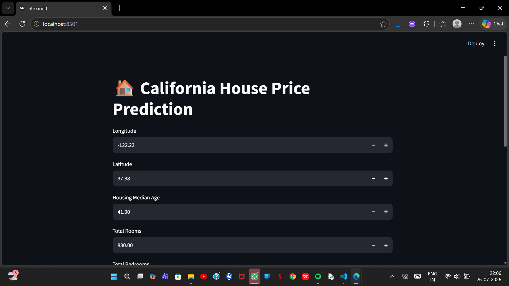

# 🏠 House Price Prediction

A Machine Learning project that predicts house prices based on various features using regression algorithms. The project includes data preprocessing, model training, evaluation, and a Streamlit web application for real-time predictions.

---

## 🚀 Project Demo

### Application Screenshot




---

## 📌 Features

✅ Data preprocessing and cleaning  
✅ Exploratory Data Analysis (EDA)  
✅ Machine Learning model training  
✅ House price prediction  
✅ User-friendly Streamlit interface  
✅ Model evaluation

---

## 🛠️ Tech Stack

- Python
- Pandas
- NumPy
- Matplotlib
- Seaborn
- Scikit-learn
- Streamlit

---

## 📂 Project Structure

```
House-Price-Prediction/
│
├── app.py                  # Streamlit application
├── model.pkl               # Trained ML model
├── requirements.txt        # Required libraries
├── README.md               # Project documentation
│
├── data/
│   └── house_data.csv
│
├── notebooks/
│   └── model_training.ipynb
│
└── screenshots/
    └── app.png
```

---

## ⚙️ Installation & Setup

Clone the repository:

```bash
git clone https://github.com/Shabarishkandagatla/House-Price-Prediction.git
```

Go to project directory:

```bash
cd House-Price-Prediction
```

Create virtual environment:

```bash
python -m venv venv
```

Activate environment:

Windows:

```bash
venv\Scripts\activate
```

Install dependencies:

```bash
pip install -r requirements.txt
```

Run the application:

```bash
streamlit run app.py
```

---

## 🤖 Machine Learning Workflow

1. Data Collection
2. Data Cleaning
3. Exploratory Data Analysis
4. Feature Engineering
5. Model Training
6. Model Evaluation
7. Deployment using Streamlit

---

## 📊 Model Used

- Linear Regression
- Decision Tree Regression
- Random Forest Regression

---

## 🎯 Future Improvements

- Improve model accuracy
- Add more real-world datasets
- Deploy using cloud platforms
- Add advanced ML algorithms

---

## 👨‍💻 Author

**Shabarish Kandagatla**

GitHub:
https://github.com/Shabarishkandagatla
